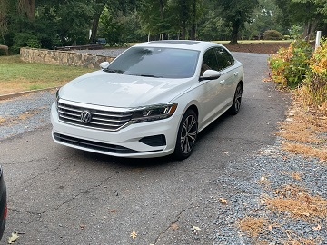
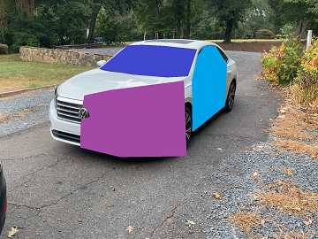
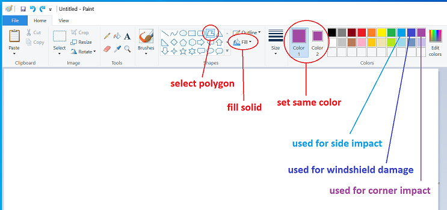

## Introduction 

In today's digital age, the use of AI to craft fraudulent images and fabricate evidence in insurance claims is becoming a rising concern. This includes not only the creation of entirely synthetic images but also the manipulation of real photos to falsely represent damages. Our project showcases the capability of advanced AI models in generating and modifying these images and provides a countermeasure to detect such forgeries, leveraging the power of machine learning.

**Fully Synthetic Images**: We've employed GPT-3.5 to summarize transcripts and extract accident details. This summarized data is then used as a prompt for the `stable-diffusion v1-5` model to generate a corresponding synthetic image representing the described accident.

**Partially Modified Images**: We've devised a method wherein we select a specific region on an authentic image and utilize a generative model to inpaint synthetic damage within that masked area, a technique known as inpainting.

## Getting Started

### Image Generation/Inpainting

Ensure you have a GPU with at least 10 GB VRAM for image inference. GPUs like K80 or V100 are recommended.

For Azure Machine Learning (AML) or a local GPU setup, execute the commands below:

```
conda create --name hackathon51 -y python=3.8
conda activate hackathon51
conda install -y pytorch==1.11.0 torchvision==0.12.0 cudatoolkit=11.3 -c pytorch
pip install --upgrade diffusers[torch] transformers
pip install -r requirements.txt
```

On a local setup, the necessary `stable diffusion` models will be downloaded automatically from Hugging Face when the inference code is triggered. However, AML restricts such downloads. You will need to either manually transfer the models from your local setup using SFTP or register them within AML.

We've registered the models from Hugging Face as `hugging-face-stable-diffusion` in AML. This encompasses both fully synthetic image generation and inpainting models.

Ensure the `stable-diffusion-v1-5` and `stable-diffusion-inpainting` model directories are situated within the `models` directory of this repository.

### Image Classification

Our classification solution is built on a PyTorch-based toolkit named MMClassification (MMPreTrain). The model's configuration file resides in `image_classifier/model`.

## Mask Generation for Inpainting

For the inpainting masks, we make use of MS Paint. The polygon shape tool with a solid fill is chosen, and we've designated three distinct colors to represent three different types of damage. The correspondence between these colors and damage types is detailed below:

```python
damage_to_mask_color = {  # Mapping from damage type to RGB mask color
    "corner_impact": (163, 73, 164),  # purple
    "windshield_damage": (63, 72, 204),  # dark blue
    "side_impact": (0, 162, 232)  # light blue
}
```
Masks shouldn't overlap. In cases where they do, only the uppermost mask remains visible.

Refer to the example image below. The top-right trio of colors in MS Paint's default color selector aligns with these damage types.




See the example reference image below. The 3 top-right colors in the default color selector correspond to these damages.



Under the hood, this single generated mask can be deconstructed into binary masks for each type of damage.


